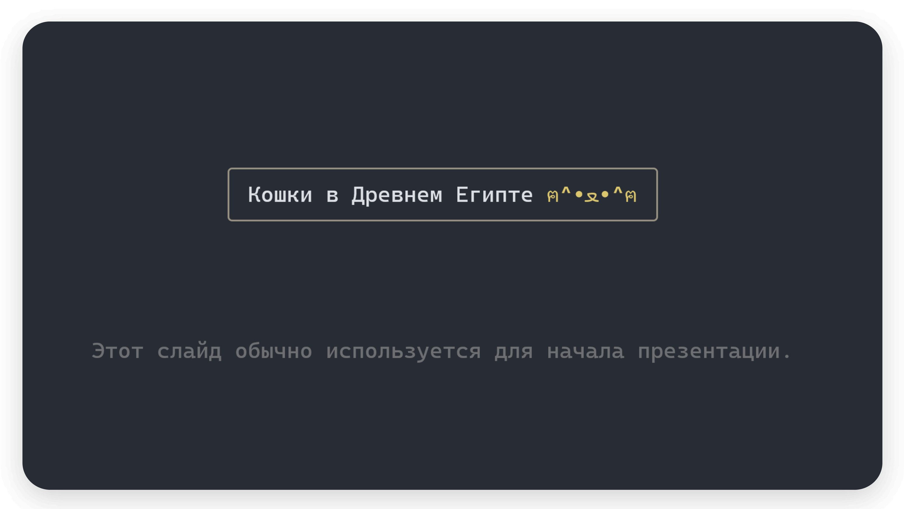
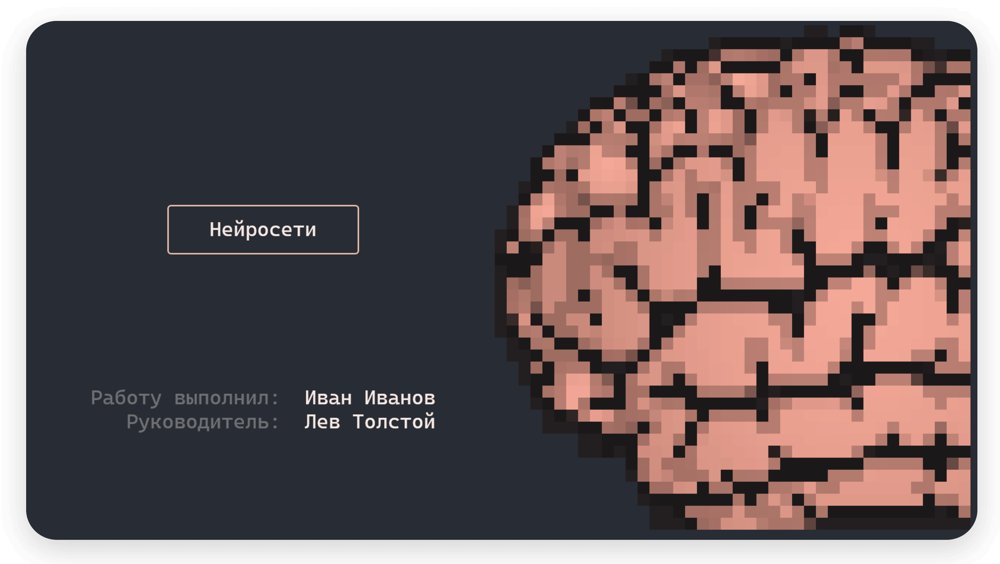

# Документация pypresentation

## Введение

Прежде чем приступить к изучению этой библиотеки, ознакомьтесь с `rich`.
Особенное внимание рекомендую уделить: [Panels](https://rich.readthedocs.io/en/stable/panel.html),
[Tables](https://rich.readthedocs.io/en/stable/tables.html), [Tree](https://rich.readthedocs.io/en/stable/tree.html),
[Layout](https://rich.readthedocs.io/en/stable/layout.html), [Group](https://rich.readthedocs.io/en/stable/group.html),
[Box](https://rich.readthedocs.io/en/stable/appendix/box.html), [Standard Colors](https://rich.readthedocs.io/en/stable/appendix/colors.html).

## Основы

Первом делом в создании презентации является импорт класса `Presentation` и создание экземпляра. Вот пример кода:

```python
from pypresentation import Presentation

presentation = Presentation()
```

Для того чтобы запустить презентацию, необходимо вызвать метод `start`.

```python
from pypresentation import Presentation

presentation = Presentation()

if __name__ == "__main__":
	presentation.start()
```

Данный код выдаст ошибку, поскольку мы пытаемся запустить презентацию, в которой нет слайдов. Давайте это исправим!

## Слайды

Основным классом, от которого наследуются все слайды, является `Slide`.
Он является небольшой обёрткой над `Layout`, в которой реализованы методы, позволяющие удобно работать со слайдами.
Например, есть метод `show`, позволяющий распечатать слайд отдельно от презентации.
Однако пока это неважно, поскольку в библиотеке уже есть встроенные слайды, давайте посмотрим на них.

### TitleSlide



```python
from pypresentation.slide import TitleSlide
from rich.table import Table, Column


def generate_subtitle() -> Table:
	table = Table(Column(justify="center"), box=None)
	table.add_row("[d]Этот слайд обычно используется для начала презентации.")
	return table


title_slide = TitleSlide(
    "Кошки в Древнем Египте [#dbc66e]ฅ^•ﻌ•^ฅ",
	subtitle=generate_subtitle(),
	border_style="#969080"
)

title_slide.show()
```

`TitleSlide` - слайд с заголовком и подзаголовком. Он принимает следующие аргументы:

- `title (str)`: Заголовок слайда.
- `subtitle (RenderableType, optional)`: Подзаголовок слайда. По умолчанию пустая строка.
- `box (Box, optional)`: Экземпляр Box, который определяет внешний вид границы заголовка. По умолчанию `box.ROUNDED`.
- `style (str, optional)`: Стиль заголовка (границы и содержимого). По умолчанию "none".
- `border_style (str, optional)`: Стиль границы заголовка. По умолчанию "none".
- `padding (PaddingDimensions, optional)`: Отступы вокруг заголовка. По умолчанию (0, 1).

### TitleImageSlide



```python
from pypresentation.slide import TitleImageSlide
from rich.table import Table, Column


def generate_subtitle() -> Table:
	table = Table(Column(justify="right"), Column(), box=None)
	table.add_row('[d]Работу выполнил:', '[#f8e9e4]Иван Иванов')
	table.add_row('[d]Руководитель:', '[#f8e9e4]Лев Толстой')

	return table


title_image_slide = TitleImageSlide(
	"[#f8e9e4]Нейросети",
	"brain.png",
	subtitle=generate_subtitle(),
	resize=(60, 60),
	padding=(0, 3),
	border_style="#e8beac",
	side="right"
)

title_image_slide.show()
```

Картинку для этого слайда можете скачать [тут](./images/brain.png).

Если вы запустите этот код, то слайд может отличаться от картинки, в этом случае рекомендую поиграться с размером
шрифта в вашем терминале.

Отдельное внимание стоит уделить подбору изображения для презентации.
Подбирать их — довольно муторное занятие, поскольку не все будут выглядеть красиво.
Вот некоторые советы: __выбирайте фото с вырезанным фоном, в высоком разрешении и ярким контрастом цветов__.

`TitleImageSlide` - слайд с заголовком, подзаголовком и изображением.

- `title (str)`: Заголовок слайда.
- `path (str)`: Путь к файлу с изображением.
- `subtitle (RenderableType, optional)`: Подзаголовок слайда. По умолчанию пустая строка.
- `side (Literal["right", "left"], optional)`: Расположение изображения на слайде. По умолчанию "left".
- `resize (tuple[int, int], optional)`: Набор значений (ширина, высота) для изменения размера изображения. По умолчанию
  половина размера окна.
- `box (Box, optional)`: Экземпляр Box, который определяет внешний вид границы заголовка. По умолчанию `box.ROUNDED`.
- `style (str, optional)`: Стиль заголовка (границы и содержимое). По умолчанию "none".
- `border_style (str, optional)`: Стиль границы заголовка. По умолчанию "none".
- `padding (PaddingDimensions, optional)`: Отступы вокруг заголовка. По умолчанию (0, 1).

### StandardSlide

Этот слайд является основой любой презентации.
Он содержит только заголовок, всё остальное предстоит написать вам.
